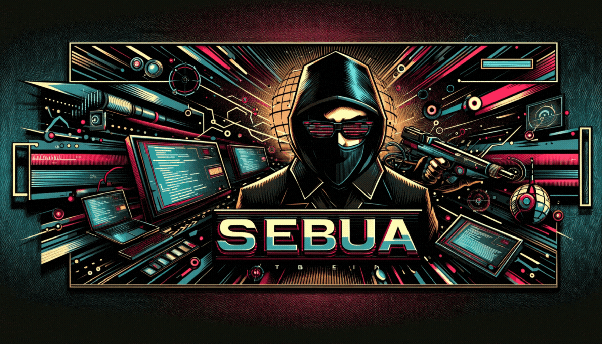

# SEBUA

## Description
**SEBUA** is described as a '*Social Engineering Browser Update Attack*'.  
This is due to user interaction being required. However, the attack itself is very deceiving.

SEBUA acts as a JavaScript payload that can be used for further exploitation during Red Team engagements:
- Once executed within the victims browser, SEBUA will detect the browser type (Chrome, Firefox or Edge).
- When the browser type matches, the `document.write` function in JavaScript is called to inject data into the webpage.
- The injected data presents a rising overlay that has a similar UI design to the official browser download page.  
- A demand is made that the browser be updated in order to view the current content.  
- Once the 'Update' button in the overlay is pressed, a download will occur for the 'downloadLink' variable specified in the JavaScript payload.  
- Upon downloading the specified binary, a key is set within the localStorage feature of the browser, that stops the overlay from appearing again.  
- So once we assume the binary has been executed, and a refresh is made to the webpage, nothing should appear out of the ordinary.
- It's that simple, either it be an XSS or hosted on your webserver, you should now have jumped to having a beacon.

## Examples

## Additional Information
The `payload.js` file should be the only thing that is needed.  
If you want to create this payload yourself, you will need to create a `document.write` call with obfuscated HTML data in the `payload.js` file.  
The way this is done is via a project called [html-obfuscator](https://github.com/BinBashBanana/html-obfuscator).  
You can use the tool mentioned above to de-obfuscate the `document.write` data within the payload, edit what is needed, then re-obfuscate.

## Credits & Resources
- [BinBashBanana](https://github.com/BinBashBanana) for having the awesome **html-obfuscator** tool that was used in this project.
- [Browser Detection](https://stackoverflow.com/questions/9847580/how-to-detect-safari-chrome-ie-firefox-and-opera-browsers) useful for detecting browser types.
- [MalwareBytes](https://www.malwarebytes.com/blog/threat-intelligence/2023/07/socgholish-copycat-delivers-netsupport-rat): FakeSG enters the ‘FakeUpdates’ arena to deliver NetSupport RAT (Inspiration behind this project).
